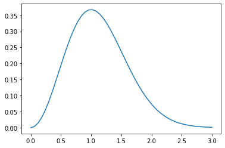
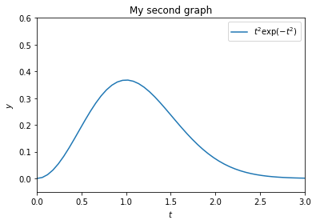
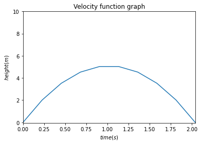
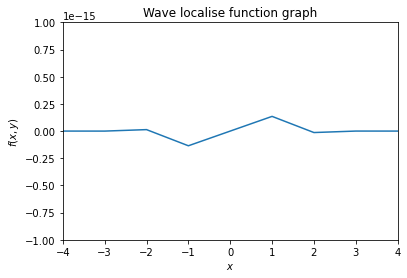
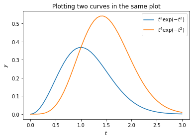
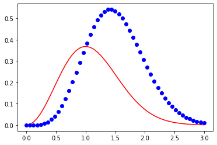
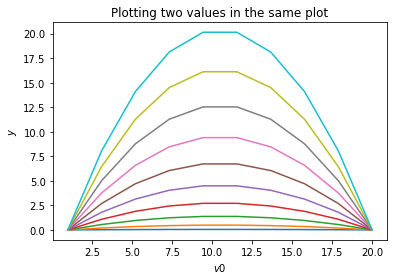
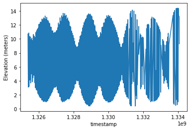
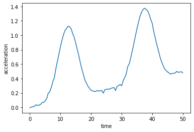

```python
import pybryt
from lecture import ok, pybryt_reference
```

    =====================================================================
    Assignment: Lecture 3
    OK, version v1.18.1
    =====================================================================
    


# Introduction to programming in Python

# Lecture 3

Learning objectives:

* Learn how to plot 2D graphs.
* Read data from files.
* Catch run-time errors and handle them gracefully rather than letting the program simply fail.
* Parse strings to extract specific data of interest.
* Use dictionaries to index data using any type of key.

## Plotting curves - the basics

If you have programmed in Python before, or when you start looking at coding examples online, you will notice a few different modules that you can import to enable you to accomplish more or less the same objective. The three most common are [matplotlib](https://matplotlib.org/index.html), [pyplot](https://matplotlib.org/api/pyplot_api.html), and pylab. We will leave it to you to read the [official documentation to see how these three are related](https://matplotlib.org/faq/usage_faq.html#matplotlib-pyplot-and-pylab-how-are-they-related). For this lecture series, we will be importing `matplotlib.pyplot` as `plt` so that it is always clear from where each function call is coming.

Let us start with a simple example by plotting the function $$y = t^2e^{-t^2}.$$


```python
import numpy as np
import matplotlib.pyplot as plt

t = np.linspace(0, 3, 51)
y = t**2 * np.exp(-t**2)
plt.plot(t, y)
plt.show()
```


    

    


Plots also should have *labels* on the axis, a *title*, and sometimes a specific extent of the axis (perhaps you wish to easily compare two graphs side-by-side):


```python
def f(t):
    return t**2 * np.exp(-t**2)


t = np.linspace(0, 3, 51)  # Generates 51 points between 0 and 3.
y = f(t)
plt.plot(t, y)

# For added awesomeness you can use LaTeX syntax.
plt.legend((r'$t^2\exp(-t^2)$',))

# Label the axes.
plt.xlabel(r'$t$')
plt.ylabel(r'$y$')

# Specify the extent of the axes [tmin, tmax, ymin, ymax].
plt.axis([0, 3, -0.05, 0.6])

# Set the plot title.
plt.title('My second graph')

plt.show()
```


    

    


## Exercise 3.1: Plot a formula

> NOTE: We have found that automated assessment is too unreliable for assessing plots. For feedback on the plots compare with your peers or ask one of the TAs to give you feedback.

Make a plot of the function $$y(t) = v_0t − {1\over2}gt^2$$ for $v_0 = 10 \,\text{ms}^{-1}$, $g = 9.81 \,\text{ms}^{-2}$, and $t \in [0, 2v_0/g]$. The label on the $x$ axis should be 'time (s)' and the label on the $y$ axis should be 'height (m)'.


```python
def my_func(v_0, g, t):
    return v_0 * t - .5 * g * (t**2)

v_0 = 10
g = 9.81
t = np.linspace(0, (2*v_0)/g, 10)  # Generates 51 points between 0 and 3.
y = my_func(v_0,g,t)
plt.plot(t, y)

# Label the axes.
plt.xlabel(r'$time (s)$')
plt.ylabel(r'$height (m)$')

# Specify the extent of the axes [tmin, tmax, ymin, ymax].
plt.axis([0, (2*v_0)/g, -0.05, 10])

# Set the plot title.
plt.title('Velocity function graph')

plt.show()
```


    

    


## Exercise 3.2: Plot another formula

The function

$$f(x, t) = e^{-(x - 3t)^2}\sin(3\pi(x - t))$$

describes, for a fixed value of $t$, a wave localised in space. Write a program that visualises this function as a function of $x$ on the interval $[−4, 4]$ when $t = 0$.


```python
from math import pi,e,sin

f = lambda x: (e**(-(x)**2)) * sin(3*pi*x)

x_s = np.linspace(-4, 4, 9)
y_s = [f(num) for num in x_s]
plt.plot(x_s, y_s)

# Label the axes.
plt.xlabel(r'$x$')
plt.ylabel(r'$f(x,y)$')

# Specify the extent of the axes [tmin, tmax, ymin, ymax].
plt.axis([-4, 4, -1e-15, 1e-15])

# Set the plot title.
plt.title('Wave localise function graph')

plt.show()
```


    

    


## Multiple curves in the same plot

We can also plot several curves in one plot:


```python
def f1(t):
    return t**2 * np.exp(-t**2)


def f2(t):
    return t**2 * f1(t)


t = np.linspace(0, 3, 51)
y1 = f1(t)
y2 = f2(t)

plt.plot(t, y1, label=r'$t^2\exp(-t^2)$')
plt.plot(t, y2, label=r'$t^4\exp(-t^2)$')
plt.legend(loc='best')  # uses labels we defined previously
plt.xlabel('$t$')
plt.ylabel('$y$')
plt.title('Plotting two curves in the same plot')

plt.show()
```


    

    


When plotting multiple curves in the same plot, PyLab usually does a good job of making sure that the different lines look different. However, sometimes you need to take action yourself (e.g. if you need to print your graph out in black&white). To do this, we can add an extra argument to the plot command, where we specify what we want - e.g. `r-` means a *red line*, while `bo` means *blue circles*:


```python
plt.plot(t, y1, 'r-')
plt.plot(t, y2, 'bo')
plt.show()
```


    

    


For further examples check out the [matplotlib](https://matplotlib.org/) documentation.

## Exercise 3.3: Plot a formula for several parameters

Write a program in which you generate 10 uniformly spaced values for $v_0$ range from 1 to 20, and plot the function $y(t) = v_0t − \frac{1}{2}gt^2$ within the time range $t \in [0, 2v_0/g]$. Assume $g = 9.81 \,\text{ms}^{-2}$.


```python
def t_s(v,g):
    return np.linspace(0,(2*v)/g,10)

def y_s(v_0,g):
    return v_0*t_s(v_0,g) - (0.5*g*(t_s(v_0,g)**2))


v_s = np.linspace(1,20,10)
g = 9.81
t = t_s(v_s,g)
y = y_s(v_s, g)

plt.plot(v_s, y)
plt.xlabel('$v0$')
plt.ylabel('$y$')
plt.title('Plotting two values in the same plot')

plt.show()
```


    

    


## Handling errors gracefully

We expect you have seen plenty of run-time errors. When an error occurs, an *exception* is *raised*. These exceptions tend to be very specific, and it is worth familiarizing yourself with them by reading the [relevant section](https://docs.python.org/3/library/exceptions.html#concrete-exceptions) from Python's documentation.

Let us take a look at an example of an out of bounds reference - this raises an exception called an `IndexError`.

```python 
places_to_visit = ("Pompeii",
                   "Fernanda de Noronha",
                   "Dolomites",
                   "Bourbon Street")
print(places_to_visit[4])

---------------------------------------------------------------------------
IndexError                                Traceback (most recent call last)
<ipython-input-6-6a516db87396> in <module>()
      1 places_to_visit = ("Pompeii", "Fernanda de Noronha", "Dolomites", "Bourbon Street")
      2 option = 4 # lets assume that the user has given the input option 4
----> 3 print(places_to_visit[option])

IndexError: tuple index out of range
```

Here we have an `IndexError` (i.e. a reference out-of-bounds) with the clarification that it is the **tuple index out of range**.

The general way we deal with this issue in Python (and in many other programming languages) is to try to do what we indend to, and if it fails, we recover from the error. This is implemented using the `try`-`except` block:
```python
try:
    <statements we indend to do>
except:
    <statements for handling errors>
```

If something goes wrong in the `try` block, Python raises an **exception**, and the execution jumps immediately to the `except` block. If you use an `except` by itself as above, then it will catch all exceptions raised, but this is generally considered bad practice as it can hide errors that you might not have anticipated - the last thing we want is to hide a bug!

Let us try an example:


```python
def get_location(index):
    places_to_visit = ("Pompeii",
                       "Fernanda de Noronha",
                       "Dolomites",
                       "Bourbon Street")

    try:
        return places_to_visit[index]
    except TypeError:
        raise TypeError("The index should be an integer.")
    except IndexError:
        raise IndexError("Values must be between 0-3.")

    return None


print("Test case 1: ", get_location(1))
```

    Test case 1:  Fernanda de Noronha


If we pass 4 as an argument, an `IndexError` is raised.

```python
print("Test case 2: ", get_location(4))

---------------------------------------------------------------------------
IndexError                                Traceback (most recent call last)
<ipython-input-9-9d82aff2337b> in get_location(index)
      7     try:
----> 8         return places_to_visit[index]
      9     except TypeError:

IndexError: tuple index out of range

During handling of the above exception, another exception occurred:

IndexError                                Traceback (most recent call last)
<ipython-input-10-baa17f0505ab> in <module>()
      1 # If we pass in 4 as an argument, an *IndexError* ia raised.
----> 2 print("Test case 2: ", get_location(4))

<ipython-input-9-9d82aff2337b> in get_location(index)
     10         raise TypeError("The index should be an integer.")
     11     except IndexError:
---> 12         raise IndexError("Values must be between 0-3.")
     13 
     14     return None

IndexError: Values must be between 0-3.
```

In the above example the expected input is an integer. If the user types a string, *e.g.*, `"four"`, then a `TypeError` is raised, and the approperiate `except`-block is executed.

```python
print("Test case 3: ", get_location("four"))

---------------------------------------------------------------------------
TypeError                                 Traceback (most recent call last)
<ipython-input-9-9d82aff2337b> in get_location(index)
      7     try:
----> 8         return places_to_visit[index]
      9     except TypeError:

TypeError: tuple indices must be integers or slices, not str

During handling of the above exception, another exception occurred:

TypeError                                 Traceback (most recent call last)
<ipython-input-10-a8af82536957> in <module>()
      2 # If the user types a string, e.g. "four", then a **TypeError** is raised,
      3 # and the approperiate except block is executed.
----> 4 print("Test case 3: ", get_location("four"))

<ipython-input-9-9d82aff2337b> in get_location(index)
      8         return places_to_visit[index]
      9     except TypeError:
---> 10         raise TypeError("The index should be an integer.")
     11     except IndexError:
     12         raise IndexError("Values must be between 0-3.")

TypeError: The index should be an integer.
```

This is still not perfect. What happens if you enter -1?


```python
print("Test case 4: ", get_location(-1))
```

    Test case 4:  Bourbon Street


Recall that negative indices traverse the list from the end to the beginning. We can deal with this issue more elegantly/robustly if we **raise** our own error:


```python
def get_location(index):
    places_to_visit = ("Pompeii",
                       "Fernanda de Noronha",
                       "Dolomites",
                       "Bourbon Street")

    try:
        if not 0 <= index < len(places_to_visit):
            raise IndexError

        return places_to_visit[index]
    except TypeError:
        raise TypeError("The index should be an integer.")
    except IndexError:
        raise IndexError("Values must be between 0-3.")

    return None
```

```python
print("Test case 5: ", get_location(-1))

---------------------------------------------------------------------------
IndexError                                Traceback (most recent call last)
<ipython-input-11-d29b7f03e343> in get_location(index)
      8         if not 0 <= index < len(places_to_visit):
----> 9             raise IndexError
     10 

IndexError: 

During handling of the above exception, another exception occurred:

IndexError                                Traceback (most recent call last)
<ipython-input-11-d29b7f03e343> in <module>()
     17     return None
     18 
---> 19 print("Test case 5: ", get_location(-1))

<ipython-input-11-d29b7f03e343> in get_location(index)
     13         raise TypeError("The index should be an integer.")
     14     except IndexError:
---> 15         raise IndexError("Values must be between 0-3.")
     16 
     17     return None

IndexError: Values must be between 0-3.
```

## Exercise 3.4: Test more in the program

Consider the equation of motion in exercise 3.1.

* Implement this as a Python function - call the function `displacement` and specify two positional arguments $t$ and $v_0$ and one keyword argument $g = 9.81\,\text{ms}^{-2}$.
* The function should raise a `ValueError` if either $t$ or $v_0$ are negative.


```python
# Uncomment and modify the code below. Do not change variable names for testing purposes.
def f(v_0,g,t):
    return v_0 * t - .5 * g * (t**2)

def displacement(t, v0, g=9.81):
    if t < 0 or v0 < 0:
        raise ValueError('t and v0 cannot be negative.')
    return v0*t - 0.5*g*t**2
```


```python
with pybryt.check(pybryt_reference(3, 4)):
    displacement(t=1.6, v0=101.4)
```

    REFERENCE: exercise-3_4
    SATISFIED: True
    MESSAGES:
      - SUCCESS: Your function computes displacement correctly.


```python
ok.grade('exercise-3_4')
```

    ~~~~~~~~~~~~~~~~~~~~~~~~~~~~~~~~~~~~~~~~~~~~~~~~~~~~~~~~~~~~~~~~~~~~~
    Running tests
    
    ---------------------------------------------------------------------
    Test summary
        Passed: 2
        Failed: 0
    [ooooooooook] 100.0% passed
    


    {'passed': 2, 'failed': 0, 'locked': 0}


## Exercise 3.5: Implement the factorial function with exception handling

The factorial of $n$, written as $n!$, is defined as

$$n! = n(n − 1)(n − 2) \cdot \ldots \cdot 2 \cdot 1,$$

with the special cases

$$1! = 1,$$ $$0! = 1.$$

For example, $4! = 4 \cdot 3 \cdot 2 \cdot 1 = 24$, and $2! = 2 \cdot 1 = 2$.

Implement your own factorial function to calculate $n!$ and name it `my_factorial`. Return $1$ immediately if $n$ is $1$ or $0$, otherwise use a loop to compute $n!$. You can use Python's own [math.factorial(x)](https://docs.python.org/3/library/math.html) to check your code.

If negative $n$ is passed, `ValueError` should be raised.


```python
# Uncomment and complete this code - keep the names the same for testing purposes.

def my_factorial(x):
    if x<0:
        raise ValueError("Input values must be positive.")
    if x == 1 or x == 0:
        return 1
    return x*my_factorial(x-1)
```


```python
with pybryt.check(pybryt_reference(3, 5)):
    my_factorial(10)
```

    REFERENCE: exercise-3_5
    SATISFIED: True
    MESSAGES:
      - SUCCESS: Great! You are multiplying values correctly.
      - SUCCESS: Your loop iterates over the correct values.
      - SUCCESS: Your function computes factorial correctly. Well done!


```python
ok.grade('exercise-3_5')
```

    ~~~~~~~~~~~~~~~~~~~~~~~~~~~~~~~~~~~~~~~~~~~~~~~~~~~~~~~~~~~~~~~~~~~~~
    Running tests
    
    ---------------------------------------------------------------------
    Test summary
        Passed: 4
        Failed: 0
    [ooooooooook] 100.0% passed
    


    {'passed': 4, 'failed': 0, 'locked': 0}


## Exercise 3.6: Wave speed

The longitudinal wave velocity in a material is given by the equation:

$$V_p = \sqrt{\frac{k+4\mu/3}{\rho}},$$

where $V_p$ is the longitudinal wave velocity, $k$ is the bulk modulus, $\mu$ is the shear modulus, and $\rho$ is the density. The shear wave velocity $V_s$ is given by the equation:
$$V_s = \sqrt{\frac{\mu}{\rho}}.$$

1. Write a function that takes as arguments $k$, $\mu$ and $\rho$, and returns $V_p$ and $V_s$.
2. Ensure your function raises a `ValueError` if any of the input arguments have a non-physical value (i.e. it cannot have negative density).

| Material               | Shear modulus (GPa) | Bulk modulus (GPa) | Density (kg/m^3)|
|------------------------|---------------------|--------------------|-----------------|
|Quartz                  | 44                  | 38                 | 2650            | 
|Clay                    | 6.85                | 20.9               | 2580            |
|Water                   | 0                   | 2.29               | 1000            |

**HINT**: Notice that $k$ and $\mu$ are in GPa and that the unit conversion is required.


```python
# Uncomment and complete this code - keep the names the same for testing purposes.

import math

def calc_material_velocity(mu, k, rho):
    mu *= 1e9  # GPa
    k *= 1e9  # GPa

    if mu < 0 or k < 0 or rho < 0:
        raise ValueError

    vp = math.sqrt((k + 4*mu/3) / rho)
    vs = math.sqrt(mu/rho)

    return vp, vs

```


```python
with pybryt.check(pybryt_reference(3, 6)):
    calc_material_velocity(1.4e9, 2.4e9, 3.6e3)
```

    REFERENCE: exercise-3_6
    SATISFIED: True
    MESSAGES:
      - SUCCESS: Your calculation of the longitudinal wave velocity is correct. Well done!
      - SUCCESS: Great! Your calculation of the shear wave velocity is correct.
      - SUCCESS: Your final solution is correct. Well done!


```python
ok.grade('exercise-3_6')
```

    ~~~~~~~~~~~~~~~~~~~~~~~~~~~~~~~~~~~~~~~~~~~~~~~~~~~~~~~~~~~~~~~~~~~~~
    Running tests
    
    ---------------------------------------------------------------------
    Test summary
        Passed: 4
        Failed: 0
    [ooooooooook] 100.0% passed
    


    {'passed': 4, 'failed': 0, 'locked': 0}


## Reading data from a plain text file

We can read text from a [text file](http://en.wikipedia.org/wiki/Text_file) into strings in a program. This is a common (and simple) way for a program to get input data. The basic recipe is:
```python
# Open text file
infile = open("myfile.txt", "r")  # "r" specifies that we are opening the file for reading

# Read next line:
line = infile.readline()

# Read the lines in a loop one by one:
for line in infile:
    <process line>

# Load all lines into a list of strings:
lines = infile.readlines()
for line in lines:
    <process line>
```

Let us look at the file [`./data/data1.txt`](./data/data1.txt) (all of the data files in this lecture are stored in the sub-folder `data/` of this notebook directory). The files has a column of numbers:

```
21.8
18.1
19
23
26
17.8
```

The goal is to read this file and calculate the mean:


```python
# Open data file
infile = open("data/data1.txt", "r")

# Initialise values
s = 0
n = 0

# Loop to compute sum
for number in infile:
    number = float(number)  # convert string to float
    s += number
    n += 1

# It is good practice to close the file when you are finished.
infile.close()

# Calculate the mean.
mean = s/n

print(mean)
```

    20.95


Let us make this example more interesting. There is a **lot** of data out there for you to discover all kinds of interesting facts - you just need to be interested in learning a little analysis. For this case we have downloaded tidal gauge data for the port of Avonmouth from the [BODC](http://www.bodc.ac.uk/). Take some time now to open the file and have a look through it - [data/2012AVO.txt](data/2012AVO.txt) you will see the [metadata](http://en.wikipedia.org/wiki/Metadata):
```
Port:              P060  
Site:              Avonmouth  
Latitude:          51.51089  
Longitude:         -2.71497  
Start Date:        01JAN2012-00.00.00  
End Date:          30APR2012-23.45.00  
Contributor:       National Oceanography Centre, Liverpool  
Datum information: The data refer to Admiralty Chart Datum (ACD)  
Parameter code:    ASLVTD02 = Surface elevation (unspecified datum) of the water body by fixed in-situ pressure sensor
```

Let us read the column ASLVTD02 (the surface elevation) and plot it:


```python
import matplotlib.pyplot as plt
import pendulum
import numpy as np

tide_file = open("data/2012AVO.txt", "r")

# Initialise an empty list to store the elevation
elevation = []
time = []

for line in tide_file:
    # Here we use a try/except block to try to read the data and
    # raise an exception if we fail to parse the data in a line
    # for some reason. This is a neat trick to skip over all the
    # header information.
    try:
        # Split this line into words.
        words = line.split()

        # If we do not have 5 words then the line must be part of the header.
        if len(words) != 5:
            raise ValueError

        # The elevation data is in the 4th column. However, the BODC
        # appends a "M" when a value is improbable and an "N" when
        # data is missing (maybe a ship dumped into it during rough weather!)
        # As we are in a try/except block, an error will be raised
        # in the float conversion when this situation arises.
        level = float(words[3])
        elevation.append(level)

        # Form a single string with the date and time.
        date_time = ' '.join(words[1:3])

        # Dealing with dates and time is a major pain as there are
        # several different formats. Luckily there are lots of people
        # out there writting libraries that are making your life easier.
        # At the moment the Python library *pendulum* seems to be the
        # best out there for parsing various different date and time
        # formats and is pretty easy to use.
        date_time = pendulum.parse(date_time)

        # So that we can plot this we are going to convert this date
        # and time into a POSIX timestamp (aka UNIX Epoch time):
        # https://en.wikipedia.org/wiki/Unix_time
        time.append(date_time.timestamp())
    except ValueError:
        pass

# For plotting lets convert the list to a NumPy array.
elevation = np.array(elevation)
time = np.array(time)

plt.plot(time, elevation)
plt.xlabel("timestamp")
plt.ylabel("Elevation (meters)")
plt.show()
```


    

    


You will notice in the above example that we used the `split()` string member function. This is a very useful function for grabbing individual words on a line. When called without any arguments it assumes that the [delimiter](http://en.wikipedia.org/wiki/Delimiter) is a blank space. However, you can use this to split a string with any delimiter, e.g. `line.split(';')` or `line.split(':')`.

## Exercise 3.7: Read a two-column data file

The file [data/xy.dat](./data/xy.dat) contains two columns of numbers, corresponding to $x$ and $y$ coordinates on a curve. The start of the file looks like this:
```
-1.0000   -0.0000  
-0.9933   -0.0087  
-0.9867   -0.0179  
-0.9800   -0.0274  
-0.9733   -0.0374
```
Make a program that reads the first column into a list `xlist` and the second column into a list `ylist`. Then convert the lists to arrays named `xarray` and `yarray`. Store the maximum and minimum y coordinates in two variables named `ymin` and `ymax`.

**Hint**: Read the file line by line, split each line into words, convert to float, and append to `xlist` and `ylist`.


```python
import numpy as np

with open('data/xy.dat', 'r') as f:
    lines = f.readlines()

xlist, ylist = [], []
for line in lines:
    fragments = list(map(float, line.split()))
    xlist.append(fragments[0])
    ylist.append(fragments[1])

xarray = np.array(xlist)
yarray = np.array(ylist)

ymin = yarray.min()
ymax = yarray.max()
```


```python
with pybryt.check(pybryt_reference(3, 7)):
    xlist, ylist, xarray, yarray, ymin, ymax
```

    REFERENCE: exercise-3_7
    SATISFIED: True
    MESSAGES:
      - SUCCESS: Your xlist is correct. Well done!
      - SUCCESS: Your ylist is correct. Well done!
      - SUCCESS: You converted the list into xarray successfully. Well done!
      - SUCCESS: Great! You converted the list into yarray successfully.
      - SUCCESS: Wow! You computed ymin correctly.
      - SUCCESS: You computed ymax correctly. Amazing!


```python
grade = ok.grade('exercise-3_7')
```

    ~~~~~~~~~~~~~~~~~~~~~~~~~~~~~~~~~~~~~~~~~~~~~~~~~~~~~~~~~~~~~~~~~~~~~
    Running tests
    
    ---------------------------------------------------------------------
    Test summary
        Passed: 9
        Failed: 0
    [ooooooooook] 100.0% passed
    


## Exercise 3.8: Read a data file

The files [data/density_water.dat](./data/density_water.dat) and [data/density_air.dat](./data/density_water.dat) contain data about the density of water and air (respectively) for different temperatures. The data files have some comment lines starting with `#`, and some lines are blank. The rest of the lines contain density data: the temperature in the first column and the corresponding density in the second column. This exercise aims to read the data in such a file, discard commented or blank lines, and plot the density versus the temperature as distinct (small) circles for each data point. Write a function `readTempDenFile` that takes a filename as an argument and returns two lists containing the temperature and the density. Call this function on both files, and store the temperature and density in lists called `temp_air_list`, `dens_air_list`, `temp_water_list` and `dens_water_list`.


```python
# Uncomment and modify the following code. Do not change variable names for testing purposes.

def readTempDenFile(filename):
    with open(filename, 'r') as infile:
        lines = infile.readlines()

    c1, c2 = [], []
    for line in lines:
        try:
            n1, n2 = map(float, line.split())
            c1.append(n1)
            c2.append(n2)
        except ValueError:
            pass

    return c1, c2


temp_air_list, dens_air_list = readTempDenFile('data/density_air.dat')
temp_water_list, dens_water_list = readTempDenFile('data/density_water.dat')
```


```python
with pybryt.check(pybryt_reference(3, 8)):
    readTempDenFile('data/density_air.dat')
```

    REFERENCE: exercise-3_8
    SATISFIED: True
    MESSAGES:
      - SUCCESS: You are extracting correct temperature values.
      - SUCCESS: You are extracting correct density values.
      - SUCCESS: Great! You are iterating through the file line by line.
      - SUCCESS: Amazing! Your function returns correct data.


```python
grade = ok.grade("exercise-3_8")
```

    ~~~~~~~~~~~~~~~~~~~~~~~~~~~~~~~~~~~~~~~~~~~~~~~~~~~~~~~~~~~~~~~~~~~~~
    Running tests
    
    ---------------------------------------------------------------------
    Test summary
        Passed: 6
        Failed: 0
    [ooooooooook] 100.0% passed
    


## Exercise 3.9: Read acceleration data and find velocities

A file [data/acc.dat](./data/acc.dat) contains measurements $a_0, a_1, \ldots, a_{n-1}$ of the acceleration of an object moving along a straight line. The measurement $a_k$ is taken at time point $t_k = k \Delta t$, where $\Delta t$ is the time spacing between the measurements. The exercise aims to load the acceleration data into a program and compute the velocity $v(t)$ of the object at some time $t$.

In general, the acceleration $a(t)$ is related to the velocity $v(t)$ through $v^\prime(t) = a(t)$. This means that

$$v(t) = v(0) + \int_0^t{a(\tau)d\tau}.$$

If $a(t)$ is only known at some discrete, equally spaced points in time, $a_0, \ldots, a_{n-1}$ (which is the case in this exercise), we must compute the integral above numerically, for example, using the Trapezoidal rule:

$$v(t_k) \approx v(0) + \Delta t \left(\frac{1}{2}a_0 + \frac{1}{2}a_k + \sum_{i=1}^{k-1}a_i \right), \ \ 1 \leq k \leq n-1. $$

We assume $v(0) = 0$, so $v_0 = 0$. Read the values $a_0, \ldots, a_{n-1}$ from file into an array `acc_array` and plot the acceleration versus time for $\Delta t = 0.5$. The time should be stored in an array named `time_array`.

Then write a function `compute_velocity(dt, k, a)` that takes as arguments a time interval $\Delta t$ as `dt`, an index `k`, and a list of accelerations `a`. The function uses the Trapezoidal rule to compute one $v(t_k)$ value and return this value. Experiment with different values of $\Delta t$ and $k$.


```python
# Uncomment and modify the following code. Do not change variable names for testing purposes.

import numpy as np
import matplotlib.pyplot as plt

with open('data/acc.dat') as f:
    lines = f.readlines()

acc_array_63 = np.array(list(map(float, lines)))

n = len(acc_array_63)
time_array_63 = np.linspace(0, (n-1)*0.5, n)
plt.plot(time_array_63, acc_array_63)
plt.xlabel('time')
plt.ylabel('acceleration')
plt.show()


def compute_velocity(dt, k, a):
    return dt * (0.5*a[0] + 0.5*a[k] + sum(a[0:k]))
```


    

    


```python
with pybryt.check(pybryt_reference(3, 9)):
    compute_velocity(1, 2, [5, 10, 12, 15, 16]), acc_array, time_array
```

    REFERENCE: exercise-3_9
    SATISFIED: False
    MESSAGES:
      - SUCCESS: Great! Array acc_array is correct.
      - SUCCESS: Well done! Array time_array is correct.
      - ERROR: Function compute_velocity returns the wrong result.


```python
grade = ok.grade('exercise-3_9')
```

    ~~~~~~~~~~~~~~~~~~~~~~~~~~~~~~~~~~~~~~~~~~~~~~~~~~~~~~~~~~~~~~~~~~~~~
    Running tests
    
    ---------------------------------------------------------------------
    question 3.9 > Suite 1 > Case 13
    
    import numpy as np
    >>> np.isclose(compute_velocity(2, 10, acc_array), 0.69115419125176)
    False
    
    # Error: expected
    #     True
    # but got
    #     False
    
    Run only this test case with "python3 ok -q exercise-3_9 --suite 1 --case 13"
    ---------------------------------------------------------------------
    Test summary
        Passed: 12
        Failed: 1
    [oooooooook.] 92.3% passed
    


## File writing

Writing a file in Python is simple. First, we open the file in writing mode (`f = open(filename, 'w')`). After that, we just collect the text we want to write in one or more strings, and, for each string, use a statement along the lines of

```python
outfile.write(string)
```

The write function does not add a newline character so you may have to do that explicitly:

```python
outfile.write(string + ’\n’)
```

That’s it! Compose the strings and write! Let's do an example. Write a nested list (table) to a file:


```python
# Let's define some table of data
data = [[0.75, 0.29619813, -0.29619813, -0.75],
        [0.29619813, 0.11697778, -0.11697778, -0.29619813],
        [-0.29619813, -0.11697778, 0.11697778, 0.29619813],
        [-0.75, -0.29619813, 0.29619813, 0.75]]

# Open the file for writing. Notice the "w" indicates we are writing!
outfile = open("tmp_table.dat", "w")
for row in data:
    for column in row:
        outfile.write("%14.8f" % column)
    outfile.write("\n")   # ensure newline
outfile.close()
```

And that's it - run the above cell and take a look at the file that was generated in your Azure library clone.


```python
ok.score()
```

    ~~~~~~~~~~~~~~~~~~~~~~~~~~~~~~~~~~~~~~~~~~~~~~~~~~~~~~~~~~~~~~~~~~~~~
    Scoring tests
    
    ---------------------------------------------------------------------
    question 3.4
        Passed: 1
        Failed: 0
    [ooooooooook] 100.0% passed
    
    ---------------------------------------------------------------------
    question 3.5
        Passed: 1
        Failed: 0
    [ooooooooook] 100.0% passed
    
    ---------------------------------------------------------------------
    question 3.6
        Passed: 1
        Failed: 0
    [ooooooooook] 100.0% passed
    
    ---------------------------------------------------------------------
    question 3.7
        Passed: 3
        Failed: 0
    [ooooooooook] 100.0% passed
    
    ---------------------------------------------------------------------
    question 3.8
        Passed: 2
        Failed: 0
    [ooooooooook] 100.0% passed
    
    ---------------------------------------------------------------------
    question 3.9 > Suite 1 > Case 13
    
    import numpy as np
    >>> np.isclose(compute_velocity(2, 10, acc_array), 0.69115419125176)
    False
    
    # Error: expected
    #     True
    # but got
    #     False
    
    Run only this test case with "python3 ok -q exercise-3_9 --suite 1 --case 13"
    ---------------------------------------------------------------------
    question 3.9
        Passed: 0
        Failed: 1
    [k..........] 0.0% passed
    
    ---------------------------------------------------------------------
    Point breakdown
        question 3.4: 1.0/1
        question 3.5: 1.0/1
        question 3.6: 1.0/1
        question 3.7: 1.0/1
        question 3.8: 1.0/1
        question 3.9: 0.0/1
    
    Score:
        Total: 5.0
    


    {'Total': 5.0}


```python

```
